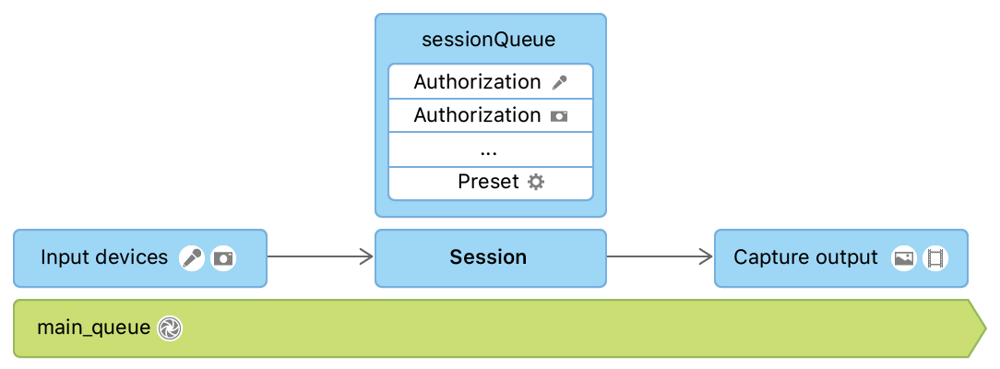
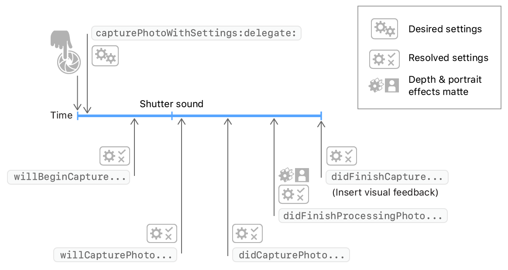
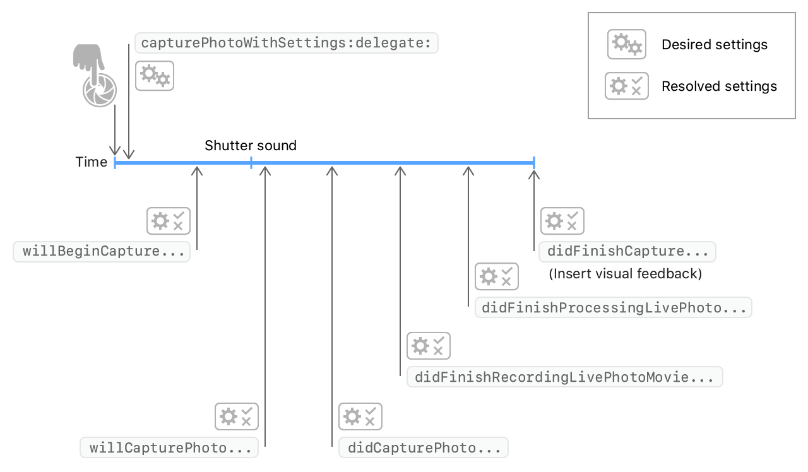
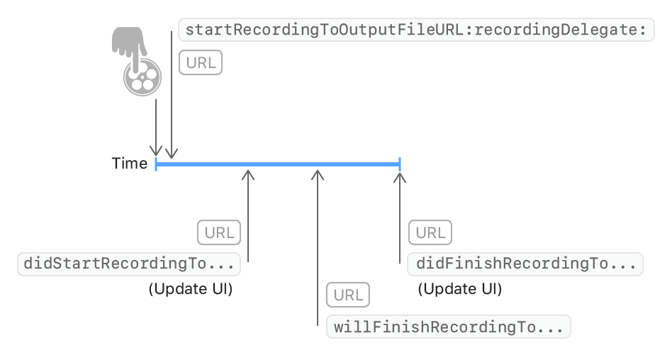

# AVCam: Building a Camera App

Capture photos with depth data and record video using the front and rear iPhone and iPad cameras.

## Overview

The iOS Camera app allows you to capture photos and movies from both the front and rear cameras. Depending on your device, the Camera app also supports the still capture of depth data, portrait effects matte, and Live Photos.

This sample code project, AVCam, shows you how to implement these capture features in your own camera app. It leverages basic functionality of the built-in front and rear iPhone and iPad cameras.

## Getting Started

To use AVCam, you need an iOS device running iOS 12 or later. Because Xcode doesn’t have access to the device camera, this sample won't work in Simulator. AVCam hides buttons for modes that the current device doesn’t support, such as portrait effects matte delivery on an iPhone 7 Plus.

## Configure a Capture Session

[`AVCaptureSession`](https://developer.apple.com/documentation/avfoundation/avcapturesession) accepts input data from capture devices like the camera and microphone. After receiving the input, `AVCaptureSession` marshals that data to appropriate outputs for processing, eventually resulting in a movie file or still photo. After configuring the capture session's inputs and outputs, you tell it to start—and later stop—capture.

``` swift
private let session = AVCaptureSession()
```

AVCam selects the rear camera by default and configures a camera capture session to stream content to a video preview view. `PreviewView` is a custom [`UIView`](https://developer.apple.com/documentation/uikit/uiview) subclass backed by an [`AVCaptureVideoPreviewLayer`](https://developer.apple.com/documentation/avfoundation/avcapturevideopreviewlayer). AVFoundation doesn't have a `PreviewView` class, but the sample code creates one to facilitate session management.

The following diagram shows how the session manages input devices and capture output:



Delegate any interaction with the `AVCaptureSession`—including its inputs and outputs—to a dedicated serial dispatch queue (`sessionQueue`), so that the interaction doesn't block the main queue. Perform any configuration involving changes to a session's topology or disruptions to its running video stream on a separate dispatch queue, since session configuration always blocks execution of other tasks until the queue processes the change. Similarly, the sample code dispatches other tasks—such as resuming an interrupted session, toggling capture modes, switching cameras, and writing media to a file—to the session queue, so that their processing doesn’t block or delay user interaction with the app.

In contrast, the code dispatches tasks that affect the UI (such as updating the preview view) to the main queue, because `AVCaptureVideoPreviewLayer`, a subclass of [`CALayer`](https://developer.apple.com/documentation/quartzcore/calayer), is the backing layer for the sample’s preview view. You must manipulate `UIView` subclasses on the main thread for them to show up in a timely, interactive fashion.

In `viewDidLoad`, AVCam creates a session and assigns it to the preview view:

``` swift
previewView.session = session
```

For more information about configuring image capture sessions, see [Setting Up a Capture Session](https://developer.apple.com/documentation/avfoundation/cameras_and_media_capture/setting_up_a_capture_session).

## Request Authorization for Access to Input Devices

Once you configure the session, it is ready to accept input. Each [`AVCaptureDevice`](https://developer.apple.com/documentation/avfoundation/avcapturedevice)—whether a camera or a mic—requires the user to authorize access. AVFoundation enumerates the authorization state using [`AVAuthorizationStatus`](https://developer.apple.com/documentation/avfoundation/avauthorizationstatus), which informs the app whether the user has restricted or denied access to a capture device.

For more information about preparing your app's `Info.plist` for custom authorization requests, see [Requesting Authorization for Media Capture](https://developer.apple.com/documentation/avfoundation/cameras_and_media_capture/requesting_authorization_for_media_capture_on_ios).


## Switch Between the Rear- and Front-Facing Cameras

The `changeCamera` method handles switching between cameras when the user taps a button in the UI. It uses a discovery session, which lists available device types in order of preference, and accepts the first device in its `devices` array. For example, the `videoDeviceDiscoverySession` in AVCam queries the device on which the app is running for available input devices. Furthermore, if a user's device has a broken camera, it won't be available in the `devices` array.

``` swift
switch currentPosition {
case .unspecified, .front:
    preferredPosition = .back
    preferredDeviceType = .builtInDualCamera
    
case .back:
    preferredPosition = .front
    preferredDeviceType = .builtInTrueDepthCamera
}
```

If the discovery session finds a camera in the proper position, it removes the previous input from the capture session and adds the new camera as an input.

``` swift
// Remove the existing device input first, since the system doesn't support simultaneous use of the rear and front cameras.
self.session.removeInput(self.videoDeviceInput)

if self.session.canAddInput(videoDeviceInput) {
    NotificationCenter.default.removeObserver(self, name: .AVCaptureDeviceSubjectAreaDidChange, object: currentVideoDevice)
    NotificationCenter.default.addObserver(self, selector: #selector(self.subjectAreaDidChange), name: .AVCaptureDeviceSubjectAreaDidChange, object: videoDeviceInput.device)
    
    self.session.addInput(videoDeviceInput)
    self.videoDeviceInput = videoDeviceInput
} else {
    self.session.addInput(self.videoDeviceInput)
}
```
[View in Source](x-source-tag://ChangeCamera)

## Handle Interruptions and Errors

Interruptions such as phone calls, notifications from other apps, and music playback may occur during a capture session. Handle these interruptions by adding observers to listen for [`AVCaptureSessionWasInterruptedNotification`](https://developer.apple.com/documentation/avfoundation/avcapturesessionwasinterruptednotification):

``` swift
NotificationCenter.default.addObserver(self,
                                       selector: #selector(sessionWasInterrupted),
                                       name: .AVCaptureSessionWasInterrupted,
                                       object: session)
NotificationCenter.default.addObserver(self,
                                       selector: #selector(sessionInterruptionEnded),
                                       name: .AVCaptureSessionInterruptionEnded,
                                       object: session)
```
[View in Source](x-source-tag://ObserveInterruption)

When AVCam receives an interruption notification, it can pause or suspend the session with an option to resume activity when the interruption ends. AVCam registers `sessionWasInterrupted` as a handler for receiving notifications, to inform the user when there's an interruption to the capture session:

``` swift
if reason == .audioDeviceInUseByAnotherClient || reason == .videoDeviceInUseByAnotherClient {
    showResumeButton = true
} else if reason == .videoDeviceNotAvailableWithMultipleForegroundApps {
    // Fade-in a label to inform the user that the camera is unavailable.
    cameraUnavailableLabel.alpha = 0
    cameraUnavailableLabel.isHidden = false
    UIView.animate(withDuration: 0.25) {
        self.cameraUnavailableLabel.alpha = 1
    }
} else if reason == .videoDeviceNotAvailableDueToSystemPressure {
    print("Session stopped running due to shutdown system pressure level.")
}
```
[View in Source](x-source-tag://HandleInterruption)

The camera view controller observes [`AVCaptureSessionRuntimeError`](AVCaptureSessionRuntimeError) to receive a notification when an error occurs:

``` swift
NotificationCenter.default.addObserver(self,
                                       selector: #selector(sessionRuntimeError),
                                       name: .AVCaptureSessionRuntimeError,
                                       object: session)
```

When a runtime error occurs, restart the capture session:

``` swift
// If media services were reset, and the last start succeeded, restart the session.
if error.code == .mediaServicesWereReset {
    sessionQueue.async {
        if self.isSessionRunning {
            self.session.startRunning()
            self.isSessionRunning = self.session.isRunning
        } else {
            DispatchQueue.main.async {
                self.resumeButton.isHidden = false
            }
        }
    }
} else {
    resumeButton.isHidden = false
}
```
[View in Source](x-source-tag://HandleRuntimeError)

The capture session may also stop if the device sustains system pressure, such as overheating. The camera won’t degrade capture quality or drop frames on its own; if it reaches a critical point, the camera stops working, or the device shuts off. To avoid surprising your users, you may want your app to manually lower the frame rate, turn off depth, or modulate performance based on feedback from [`AVCaptureSystemPressureState`](https://developer.apple.com/documentation/avfoundation/avcapturesystempressurestate):

``` swift
let pressureLevel = systemPressureState.level
if pressureLevel == .serious || pressureLevel == .critical {
    if self.movieFileOutput == nil || self.movieFileOutput?.isRecording == false {
        do {
            try self.videoDeviceInput.device.lockForConfiguration()
            print("WARNING: Reached elevated system pressure level: \(pressureLevel). Throttling frame rate.")
            self.videoDeviceInput.device.activeVideoMinFrameDuration = CMTimeMake(value: 1, timescale: 20 )
            self.videoDeviceInput.device.activeVideoMaxFrameDuration = CMTimeMake(value: 1, timescale: 15 )
            self.videoDeviceInput.device.unlockForConfiguration()
        } catch {
            print("Could not lock device for configuration: \(error)")
        }
    }
} else if pressureLevel == .shutdown {
    print("Session stopped running due to shutdown system pressure level.")
}
```
[View in Source](x-source-tag://HandleSystemPressure)

## Capture a Photo

Taking a photo happens on the session queue. The process begins by updating the [`AVCapturePhotoOutput`]((https://developer.apple.com/documentation/avfoundation/avcapturephotooutput)) connection to match the video orientation of the video preview layer. This enables the camera to accurately capture what the user sees onscreen:

``` swift
if let photoOutputConnection = self.photoOutput.connection(with: .video) {
    photoOutputConnection.videoOrientation = videoPreviewLayerOrientation!
}
```

After aligning the outputs, AVCam proceeds to create [`AVCapturePhotoSettings`](https://developer.apple.com/documentation/avfoundation/avcapturephotosettings) to configure capture parameters such as focus, flash, and resolution:

``` swift
var photoSettings = AVCapturePhotoSettings()

// Capture HEIF photos when supported. Enable auto-flash and high-resolution photos.
if  self.photoOutput.availablePhotoCodecTypes.contains(.hevc) {
    photoSettings = AVCapturePhotoSettings(format: [AVVideoCodecKey: AVVideoCodecType.hevc])
}

if self.videoDeviceInput.device.isFlashAvailable {
    photoSettings.flashMode = .auto
}

photoSettings.isHighResolutionPhotoEnabled = true
if !photoSettings.__availablePreviewPhotoPixelFormatTypes.isEmpty {
    photoSettings.previewPhotoFormat = [kCVPixelBufferPixelFormatTypeKey as String: photoSettings.__availablePreviewPhotoPixelFormatTypes.first!]
}
if self.livePhotoMode == .on && self.photoOutput.isLivePhotoCaptureSupported { // Live Photo capture is not supported in movie mode.
    let livePhotoMovieFileName = NSUUID().uuidString
    let livePhotoMovieFilePath = (NSTemporaryDirectory() as NSString).appendingPathComponent((livePhotoMovieFileName as NSString).appendingPathExtension("mov")!)
    photoSettings.livePhotoMovieFileURL = URL(fileURLWithPath: livePhotoMovieFilePath)
}

photoSettings.isDepthDataDeliveryEnabled = (self.depthDataDeliveryMode == .on
    && self.photoOutput.isDepthDataDeliveryEnabled)

photoSettings.isPortraitEffectsMatteDeliveryEnabled = (self.portraitEffectsMatteDeliveryMode == .on
    && self.photoOutput.isPortraitEffectsMatteDeliveryEnabled)
```

The sample uses a separate object, the `PhotoCaptureProcessor`, for the photo capture delegate to isolate each capture life cycle. This clear separation of capture cycles is necessary for Live Photos, where a single capture cycle may involve the capture of several frames.

Each time the user presses the central shutter button, AVCam captures a photo with the previously configured settings by calling [`capturePhotoWithSettings`](https://developer.apple.com/documentation/avfoundation/avcapturephotooutput/1648765-capturephotowithsettings):

``` swift
self.photoOutput.capturePhoto(with: photoSettings, delegate: photoCaptureProcessor)
```
[View in Source](x-source-tag://CapturePhoto)

The `capturePhoto` method accepts two parameters:

* An `AVCapturePhotoSettings` object that encapsulates the settings your user configures through the app, such as exposure, flash, focus, and torch.

* A delegate that conforms to the [`AVCapturePhotoCaptureDelegate`](https://developer.apple.com/documentation/avfoundation/avcapturephotocapturedelegate) protocol, to respond to subsequent callbacks that the system delivers during photo capture.

Once the app calls [`capturePhoto`](https://developer.apple.com/documentation/avfoundation/avcapturephotooutput/1648765-capturephoto), the process for starting photography is over. From that point forward, operations on that individual photo capture happens in delegate callbacks.

## Track Results Through a Photo Capture Delegate

The  method `capturePhoto` only begins the process of taking a photo. The rest of the process happens in delegate methods that the app implements.



- [`photoOutput(_:willBeginCaptureFor:)`](https://developer.apple.com/documentation/avfoundation/avcapturephotocapturedelegate/1778621-photooutput) arrives first, as soon as you call `capturePhoto`. The resolved settings represent the actual settings that the camera will apply for the upcoming photo. AVCam uses this method only for behavior specific to Live Photos. AVCam tries to tell if the photo is a Live Photo by checking its [`livePhotoMovieDimensions`](https://developer.apple.com/documentation/avfoundation/avcaptureresolvedphotosettings/1648781-livephotomoviedimensions) size; if the photo is a Live Photo, AVCam increments a count to track Live Photos in progress:

``` swift
self.sessionQueue.async {
    if capturing {
        self.inProgressLivePhotoCapturesCount += 1
    } else {
        self.inProgressLivePhotoCapturesCount -= 1
    }
    
    let inProgressLivePhotoCapturesCount = self.inProgressLivePhotoCapturesCount
    DispatchQueue.main.async {
        if inProgressLivePhotoCapturesCount > 0 {
            self.capturingLivePhotoLabel.isHidden = false
        } else if inProgressLivePhotoCapturesCount == 0 {
            self.capturingLivePhotoLabel.isHidden = true
        } else {
            print("Error: In progress Live Photo capture count is less than 0.")
        }
    }
}
```
[View in Source](x-source-tag://WillBeginCapture)

- [`photoOutput(_:willCapturePhotoFor:)`](https://developer.apple.com/documentation/avfoundation/avcapturephotocapturedelegate/1778625-photooutput) arrives right after the system plays the shutter sound. AVCam uses this opportunity to flash the screen, alerting to the user that the camera captured a photo. The sample code implements this flash by animating the preview view layer's `opacity` from `0` to `1`.

``` swift
// Flash the screen to signal that AVCam took a photo.
DispatchQueue.main.async {
    self.previewView.videoPreviewLayer.opacity = 0
    UIView.animate(withDuration: 0.25) {
        self.previewView.videoPreviewLayer.opacity = 1
    }
}
```
[View in Source](x-source-tag://WillCapturePhoto)

-  [`photoOutput(_:didFinishProcessingPhoto:error:)`](https://developer.apple.com/documentation/avfoundation/avcapturephotocapturedelegate/2873949-photooutput) arrives when the system finishes processing depth data and a portrait effects matte. AVCam checks for a portrait effects matte and depth metadata at this stage:

``` swift
// Portrait effects matte gets generated only if AVFoundation detects a face.
if var portraitEffectsMatte = photo.portraitEffectsMatte {
    if let orientation = photo.metadata[ String(kCGImagePropertyOrientation) ] as? UInt32 {
        portraitEffectsMatte = portraitEffectsMatte.applyingExifOrientation( CGImagePropertyOrientation(rawValue: orientation)! )
    }
    let portraitEffectsMattePixelBuffer = portraitEffectsMatte.mattingImage
    let portraitEffectsMatteImage = CIImage( cvImageBuffer: portraitEffectsMattePixelBuffer, options: [ .auxiliaryPortraitEffectsMatte: true ] )
```
[View in Source](x-source-tag://DidFinishProcessingPhoto)

- [`photoOutput(_:didFinishCaptureFor:error:)`](https://developer.apple.com/documentation/avfoundation/avcapturephotocapturedelegate/1778618-photooutput) is the final callback, marking the end of capture for a single photo. AVCam cleans up its delegate and settings so they don't remain for subsequent photo captures:

``` swift
self.sessionQueue.async {
    self.inProgressPhotoCaptureDelegates[photoCaptureProcessor.requestedPhotoSettings.uniqueID] = nil
}
```
[View in Source](x-source-tag://DidFinishCapture)

You can apply other visual effects in this delegate method, such as animating a preview thumbnail of the captured photo.

For more information about tracking photo progress through delegate callbacks, see [`Tracking Photo Capture Progress`](https://developer.apple.com/documentation/avfoundation/cameras_and_media_capture/capturing_still_and_live_photos/tracking_photo_capture_progress).

## Capture Live Photos

When you enable capture of Live Photos, the camera takes one still image and a short movie around the moment of capture. The app triggers Live Photo capture the same way as still photo capture: through a single call to `capturePhotoWithSettings`, where you pass the URL for the Live Photos short video through the [`livePhotoMovieFileURL`](https://developer.apple.com/documentation/avfoundation/avcapturephotosettings/1648681-livephotomoviefileurl) property. You can enable Live Photos at the `AVCapturePhotoOutput` level, or you can configure Live Photos at the `AVCapturePhotoSettings` level on a per-capture basis.

Since Live Photo capture creates a short movie file, AVCam must express where to save the movie file as a URL. Also, because Live Photo captures can overlap, the code must keep track of the number of in-progress Live Photo captures to ensure that the Live Photo label stays visible during these captures. The `photoOutput(_:willBeginCaptureFor:)` delegate method in the previous section implements this tracking counter.



- [`photoOutput(_:didFinishRecordingLivePhotoMovieForEventualFileAt:resolvedSettings:)`](https://developer.apple.com/documentation/avfoundation/avcapturephotocapturedelegate/1778658-photooutput) fires when recording of the short movie ends. AVCam dismisses the Live badge here. Because the camera has finished recording the short movie, AVCam executes the Live Photo handler decrementing the completion counter:

``` swift
livePhotoCaptureHandler(false)
```
[View in Source](x-source-tag://DidFinishRecordingLive)

- [`photoOutput(_:didFinishProcessingLivePhotoToMovieFileAt:duration:photoDisplayTime:resolvedSettings:error:)`](https://developer.apple.com/documentation/avfoundation/avcapturephotocapturedelegate/1778637-photooutput) fires last, indicating that the movie is fully written to disk and is ready for consumption. AVCam uses this opportunity to display any capture errors and redirect the saved file URL to its final output location:

``` swift
if error != nil {
    print("Error processing Live Photo companion movie: \(String(describing: error))")
    return
}
livePhotoCompanionMovieURL = outputFileURL
```
[View in Source](x-source-tag://DidFinishProcessingLive)

For more information about incorporating Live Photo capture into your app, see [Capturing Still and Live Photos](https://developer.apple.com/documentation/avfoundation/cameras_and_media_capture/capturing_still_and_live_photos).


## Capture Depth Data and Portrait Effects Matte

Using `AVCapturePhotoOutput`, AVCam queries the capture device to see whether its configuration can deliver depth data and a portrait effects matte to still images. If the input device supports either of these modes, and you enable them in the capture settings, the camera attaches depth and portrait effects matte as auxiliary metadata on a per-photo request basis. If the device supports delivery of depth data, portrait effects matte, or Live Photos, the app shows a button, used to toggle the settings for enabling or disabling the feature.

``` swift
if self.photoOutput.isDepthDataDeliverySupported {
    self.photoOutput.isDepthDataDeliveryEnabled = true
    
    DispatchQueue.main.async {
        self.depthDataDeliveryButton.isHidden = false
        self.depthDataDeliveryButton.isEnabled = true
    }
}

if self.photoOutput.isPortraitEffectsMatteDeliverySupported {
    self.photoOutput.isPortraitEffectsMatteDeliveryEnabled = true
    
    DispatchQueue.main.async {
        self.portraitEffectsMatteDeliveryButton.isHidden = false
        self.portraitEffectsMatteDeliveryButton.isEnabled = true
    }
}
```
[View in Source](x-source-tag://EnableDisableModes)

The camera stores depth and portrait effects matte metadata as auxiliary images, discoverable and addressable through the [`Image IO`](https://developer.apple.com/documentation/imageio) API. AVCam accesses this metadata by searching for an auxiliary image of type [`auxiliaryPortraitEffectsMatte`](https://developer.apple.com/documentation/imageio/kcgimageauxiliarydatatypeportraiteffectsmatte):

```
if var portraitEffectsMatte = photo.portraitEffectsMatte {
    if let orientation = photo.metadata[String(kCGImagePropertyOrientation)] as? UInt32 {
        portraitEffectsMatte = portraitEffectsMatte.applyingExifOrientation(CGImagePropertyOrientation(rawValue: orientation)!)
    }
    let portraitEffectsMattePixelBuffer = portraitEffectsMatte.mattingImage
```

For more information about depth data capture, see [Capturing Photos with Depth](https://developer.apple.com/documentation/avfoundation/cameras_and_media_capture/capturing_photos_with_depth).

## Save Photos to the User’s Photo Library

Before you can save an image or movie to the user's photo library, you must first request access to that library. The process for requesting write authorization mirrors capture device authorization: show an alert with text that you provide in the `Info.plist`.

AVCam checks for authorization in the ['captureOutput:didFinishRecordingToOutputFileAtURL:fromConnections'](https://developer.apple.com/documentation/avfoundation/avcapturefileoutputrecordingdelegate/1390612-captureoutput) callback method, which is where the `AVCaptureOutput` provides media data to save as output.

```
PHPhotoLibrary.requestAuthorization { status in
```

For more information about requesting access to the user's photo library, see [Requesting Authorization to Access Photos](https://developer.apple.com/documentation/photokit/requesting_authorization_to_access_photos).

## Record Movie Files

AVCam supports video capture by querying and adding input devices with the `.video` qualifier. The app defaults to the rear dual camera, but, if the device doesn't have a dual camera, the app defaults to the wide-angle camera.

``` swift
if let dualCameraDevice = AVCaptureDevice.default(.builtInDualCamera, for: .video, position: .back) {
    defaultVideoDevice = dualCameraDevice
} else if let backCameraDevice = AVCaptureDevice.default(.builtInWideAngleCamera, for: .video, position: .back) {
    // If a rear dual camera is not available, default to the rear wide angle camera.
    defaultVideoDevice = backCameraDevice
} else if let frontCameraDevice = AVCaptureDevice.default(.builtInWideAngleCamera, for: .video, position: .front) {
    // In the event that the rear wide angle camera isn't available, default to the front wide angle camera.
    defaultVideoDevice = frontCameraDevice
}
```

Instead of passing settings to the system as with still photography, pass an output URL like in Live Photos. The delegate callbacks provide the same URL, so your app doesn’t need to store it in an intermediate variable.

Once the user taps Record to begin capture, AVCam calls [`startRecording`](https://developer.apple.com/documentation/avfoundation/avcapturefileoutput/1387224-startrecording):

``` swift
movieFileOutput.startRecording(to: URL(fileURLWithPath: outputFilePath), recordingDelegate: self)
```

Just like `capturePhoto` triggered delegate callbacks for still capture, `startRecording` triggers a series of delegate callbacks for movie recording.



Track the progress of the movie recording through the delegate callback chain. Instead of implementing `AVCapturePhotoCaptureDelegate`, implement [`AVCaptureFileOutputRecordingDelegate`](https://developer.apple.com/documentation/avfoundation/avcapturefileoutputrecordingdelegate). Since the movie-recording delegate callbacks require interaction with the capture session, AVCam makes `CameraViewController` the delegate instead of creating a separate delegate object.

- [`fileOutput(_:didStartRecordingTo:from:)`](https://developer.apple.com/documentation/avfoundation/avcapturefileoutputrecordingdelegate/1387301-fileoutput) fires when the file output starts writing data to a file. AVCam uses this opportunity to change the Record button to a Stop button:

``` swift
DispatchQueue.main.async {
    self.recordButton.isEnabled = true
    self.recordButton.setImage(#imageLiteral(resourceName: "CaptureStop"), for: [])
}
```
[View in Source](x-source-tag://DidStartRecording)

- [`fileOutput(_:didFinishRecordingTo:from:error:)`](https://developer.apple.com/documentation/avfoundation/avcapturefileoutputrecordingdelegate/1390612-fileoutput) fires last, indicating that the movie is fully written to disk and is ready for consumption. AVCam takes this chance to move the temporarily saved movie from the given URL to the user’s photo library or the app’s documents folder:

``` swift
PHPhotoLibrary.shared().performChanges({
    let options = PHAssetResourceCreationOptions()
    options.shouldMoveFile = true
    let creationRequest = PHAssetCreationRequest.forAsset()
    creationRequest.addResource(with: .video, fileURL: outputFileURL, options: options)
}, completionHandler: { success, error in
    if !success {
        print("AVCam couldn't save the movie to your photo library: \(String(describing: error))")
    }
    cleanup()
}
)
```
[View in Source](x-source-tag://DidFinishRecording)

In the event that AVCam goes into the background—such as when the user accepts an incoming phone call—the app must ask permission from the user to continue recording. AVCam requests time from the system to perform this saving through a background task. This background task ensures that there is enough time to write the file to the photo library, even when AVCam recedes to the background. To conclude background execution, AVCam calls [`endBackgroundTask`](https://developer.apple.com/documentation/uikit/uiapplication/1622970-endbackgroundtask) in  [`didFinishRecordingTo`](https://developer.apple.com/documentation/avfoundation/avcapturefileoutputrecordingdelegate/1390612-fileoutput) after saving the recorded file.

``` swift
self.backgroundRecordingID = UIApplication.shared.beginBackgroundTask(expirationHandler: nil)
```

## Take Photos While Recording a Movie

Like the iOS Camera app, AVCam can take photos while also capturing a movie. AVCam captures such photos at the same resolution as the video.

``` swift
let movieFileOutput = AVCaptureMovieFileOutput()

if self.session.canAddOutput(movieFileOutput) {
    self.session.beginConfiguration()
    self.session.addOutput(movieFileOutput)
    self.session.sessionPreset = .high
    if let connection = movieFileOutput.connection(with: .video) {
        if connection.isVideoStabilizationSupported {
            connection.preferredVideoStabilizationMode = .auto
        }
    }
    self.session.commitConfiguration()
    
    DispatchQueue.main.async {
        captureModeControl.isEnabled = true
    }
    
    self.movieFileOutput = movieFileOutput
    
    DispatchQueue.main.async {
        self.recordButton.isEnabled = true
    }
}
```
